# Disclaimer:

These are notes while I progressed through [7.01 - Getting up to Speed in Biology](https://openlearninglibrary.mit.edu/courses/course-v1:OCW+Pre-7.01+1T2020/course/).

The content for this course is covered by the [CC BY-NC-SA 4.0 license](https://creativecommons.org/licenses/by-nc-sa/4.0/legalcode), the gist of which can be found [here](https://creativecommons.org/licenses/by-nc-sa/4.0/).  The notes below are my own, and any modifications to images are annotated below the images.


# 7.01 - Getting Up to Speed in Biology

## Quick Help: Typing Key Codes

https://usefulshortcuts.com/alt-codes/maths-alt-codes.php

* ▲ = alt+30
* δ = alt+235
* ≡ = alt+240
* ■ = alt+254
* ∃ = ??????


## Lecture 1: Molecules of Life

### 1.1 

* Cells are 10 microns 
* 1 micron == 1 um

Key Elements

* C, O, N, P, S
* Valency - number of bonds an atom can make
* C-H is represented by a single line
* C-O is a single bond where C "contributes" an electron to O
* C-H is a single bond where C <=> H 
* C makes 4 bonds

O has 6 valence electrons.  C-O "adds" 1 to O; O-H "adds" another one to O (and to H)

Oh, I see.  A line that ends in OH has no C at the end of the line.  I missed that.  If a molecule is at the end of a line, there is no C


### 1.2 Polar and non-polar molecules

I'm guessing water is actually polar because it is [3-dimensional](https://chemistrytalk.org/wp-content/uploads/2022/07/640px-VSEPR_acqua-300x281.png).  I'm focused on the geometry here, but her lesson indicates that the polarity of the atom is more important.  O is electronegative.  What makes it electronegative?

Big lesson: Oxygen is electronegative.

CO2 is non-polar due to the vector sum of electronegativity.  This has to do with its geometry (it's a linear molecule).  It's linear because the C "donates" electrons to the Oxygen (an ionic bond?).  C has 4 valence electrons, O has 6.  O and C form double covalent bonds, which means that 2 electrons from O and two from C are shared and contribute to the outer valence shell of each atom, thus completing both shells.

H20 is a covalent bond.  ~~CO2 is an ionic bond (?)~~.  No, CO2 is actually a double-covalent bond!!!  That explains it.  Apparently ionic bonds are made mostly (only?) between metals and non-metals.  Everything else (that's not a Hydrogen bond, which is actually covalent anyway) should "default" to covalence.  CO2 is actually O=C=O.  Thus, CO2 is also non-polar due to its geometry and resultant vector sum of electronegativity.

### 1.3 Types of Bonds

* Ionic
* Covalent
* Hydrogen
* van der Waals/non-polar

What is "electrostatic" bond?

### 1.4 Recognizing Macromolecules

4 major classes of macromolecules

* Lipids
  * Cell membranes
  * Insulation
  * Signaling
  * Energy storage
  * Basic structure - Long CH2 (methyl) chain 
  * Almost always non-polar (thus hydrophopic) <= key characteristic used to identify them
  * Some partially polar (amphipathic)
* Carbohydrates
  * Aside: They give you your blood type
  * Energy
  * Information 
  * Cell walls of plants
  * DNA
  * CH20 is the basic chemical formula
  * Monomer is monosaccharides (sugars), these give rise to chains
  * Polymers (glycogen/starch)
  * Monomors joined into polymers by glycosidic bonds (C-O-C)
  * Isomeric forms (isomer is a slight rearrangement of the structure of the molecule)
* Nucleic acids
  * Genes made of nucleic acids
  * Protein synthesis
  * Carry hereditary information
  * monomer = nucleotide
  * polymer = DNA or RNA
  * Structure
    * phosphate - sugar - base, abbreviated P-S-B
    * Sugar is a 5-carbon sugar, either ribose or possibly deoxyribose
    * DNA = 4 nucleotide bases
      * Purines => 2 Carbon rings
        * Adenine => C5 H5 N5
        * Guanine => C5 H5 N5 O
      * Pyrimidines => 1 carbon ring
        * Cytosine => C4 H5 N3 O
        * Thymine => C5 H6 N2 O2
      * Sugar is deoxyribose
    * RNA 
      * Uracil (C4 H4 N2 O2) replaces Thymine (A,G,C,U)
      * Ribose is the sugar
  * Question: Why haven't we discussed the phosphate

  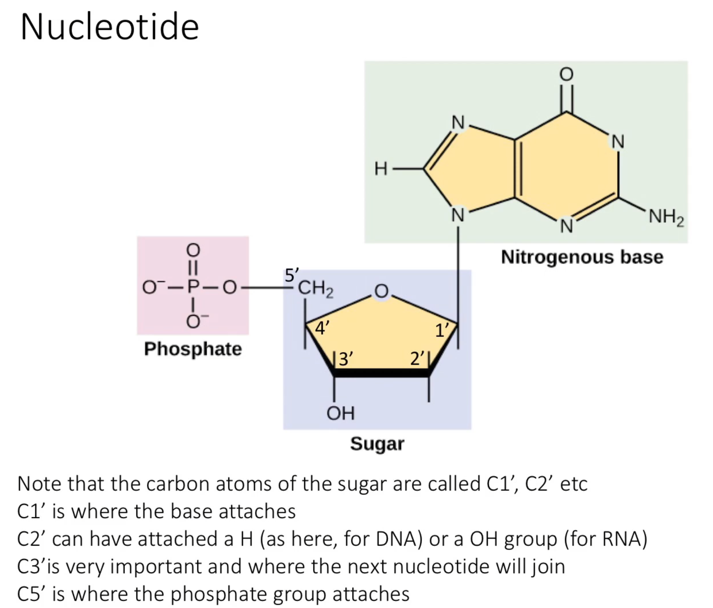
  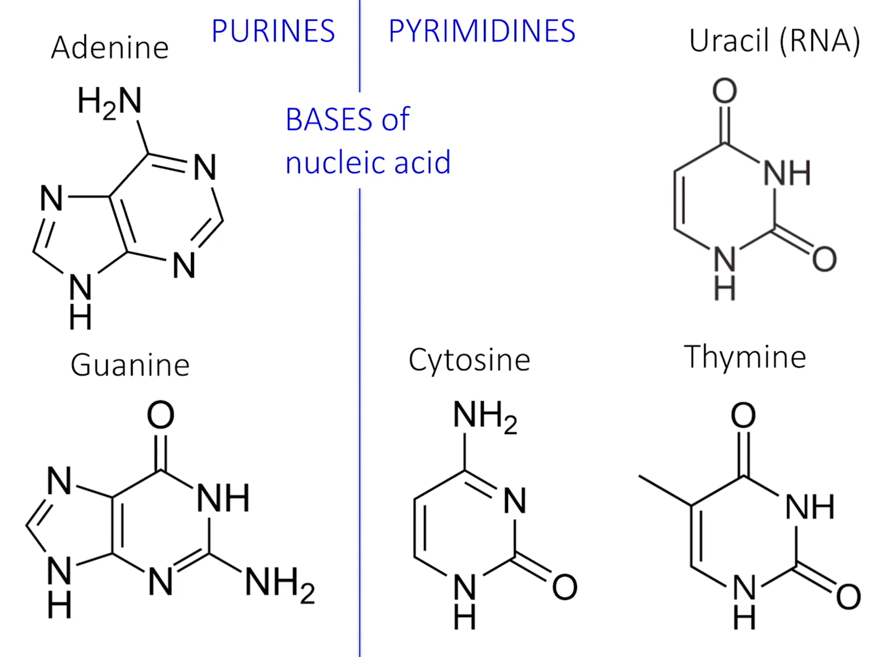
    
  * CH3 is a `methyl group`.  Uracil is Thymine that lacks a methyl group
* Proteins
  * Structure of cell
  * Enzymes (which are catalysts)
  * Signaling
  * Cellular motors
  * monomer = amino acid
  * 20 common amino acids
  * Protein => amino acid polymer
  * Structure built around alpha carbon 
  * Amino acid => alpha carbon + NH2 (amino) + COOH (carboxyl) + R = side group
  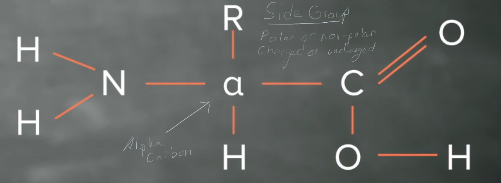
  `Note: The above image is modified from the course content to include annotations about side groups and alpha carbons.`

Exercise: Go look at amino acids and figure out charge and polarity for each...
* Clearly I need to review polarity and charge
* Charge is indicated by ionic annotations
* Polarity is indicated by the presence of polar molecules in the R group
    * Why is tyrosine not polar?
    * Apparently the agreement of polarity and hydrophobia is complicated.  
Aside: This makes me want to do virtual reality representations of molecules

### 1.5 Nucleic Acid Polarity

* Nucleic acids store information
* Macromolecules have order and polarity = information
    * Identifier/"information" is the nitrogenous base (A,G,T,C,U)
    * Order then determines the catalog of information
* Nucleic acids are constructed with a 5' and 3' end.  The chain is a series of phosphate - sugar bonds (P - S).  Each sugar has a base "hanging off it."  The phosphate is the 5' end, and the sugar is the 3' end  A P-S is a phosphodiester bond.
* 5' is the phosphate, 3' is a hydroxyl
* Base order ascends (B1, B2, B3) beginning at the 5' end
* New monomers are added to the 3' end

### 1.6 Protein Polarity

* N || NH2 || Amino is the one end
* N-A-B-C-D-
    Followed by C || COOH || Carboxy
* Peptide bond b/w NH2 and COOH join amino acids
* Polarity is based on Amino and Carboxy ends
* Information is the amino acid order
* amino acids get added to carboxy end
* order is from amino -> carboxyl
* e.g., N-Gly-Ala-C or N-Ser-Val-Met-Gly-C 
* An amino acid chain is a polypeptide, named due to the peptide bonds between amino acids

## Lesson 2: The Cell and How it Works

### 2.1

* Metabolism - sum of all chemical reactions in a cell
* Two major types of reactions: 
  * catabolic -> break down molecules (hydrolysis, release a water).  Consumes water
    * M-O-M + H2O = 2M-OH   ==>> Catabolic reaction that produces 2 monomers (consumes a water)
  * anabolic  (build up, condensation) put things together, release water
    * M-OH + M-OH => M-O-M + 2H20 (releases a water)

### 2.2 Free Energy and Reaction Kinetics

* Free energy == ▲G  (this delta is alt+30 whereas δ is alt+235)
* Equation 
  * `▲G = ▲H - T▲S` where H= enthalpy (total energy), T = temperature, S = entropy (unusuable energy)
    * Aside: Called ▲G b/c of Josiah Willard Gibbs; known as the `Gibbs equation`
    * I guess the `T` is in here because temperature corresponds to external energy.  No energy exists at absolute 0 
* Reaction (R), Products (P)
  * R <-> P 
  * `▲G < 0` => energy released, reaction proceeds, spontaneous, exergonic
  * `▲G > 0` => energy consumed/required for reaction to proceed, endogonic
  * `▲G = 0` => equilibrium,   R->P = P->R
* Substrate is synonym for reactant
* Sometimes exergonic reactions still require "activation energy"; called an energy barrier
* Catalysts reduce the required activation energy
  * In life, these are called enzymes.  Mostly they're proteins
* Enzymes are specific for every reaction.  They don't change ▲G (energy released or consumed), but instead speed up reaction rate
* Substrates get to enzyme's activation site and bind, pushing passed activation barrier.  Catalysis happens, forms product

### 2.3 Pathways

* Series of linked chemical reactions to result in a product, which use enzymes
* Feedback control to ...
* Positive (make more) and negative (make less) are feedback controls
* Can be external signals (outside cell) that control pathways
* Production `---->`
* Inhibition `----|`
* Production and inhibition are feedback loops.  
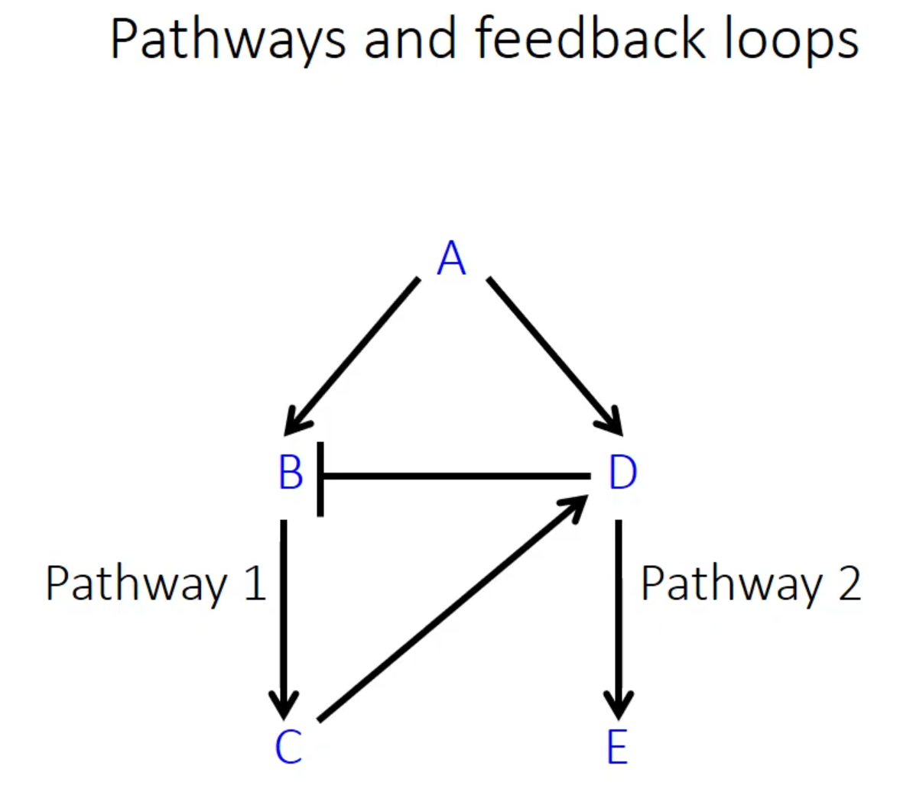

### 2.4 Organelles

* Cell membrane is a lipid bi-layer that is mostly hydrophobic
* Aside: Need to notice the lipid by sight here.  Remember that these are non-polar methyl groups with a possibly polar end
* phosphlipids surround cell.  Have a positive charge on one side (made of a phosphate and glycerol).  
* Sub-cellular structures are called organelles, and have specific functions
  * organelles may be membrane-bound
* Eukaryotic organelles
  * nucleus - carries genes/dna
  * cytoplasm - everything that's not the nucleus, containing:
    * (animals) mitochondrion - energy conversion, where ready energy is produced (ATP).  Also contains dna/rna/genetic material
    * (plants) chloroplast - energy conversion
    * endoplasmic reticullum - routing, modifying new polypeptide chains; synthesizing lipids; more
    * ribosomes - assembling polypeptide chains (no membrane)
    * golgi apparatus - protein synthesis, modifying polypeptide chains; sorting, shipping proteins and lipids
    * lysosome - breakdown cellular components
    * cytoskeleton, cilia, flagella -> movement, shape, structure

`Note: I really need a good way to remember the functions/contributions of organelles.  Rote memorization isn't working here for how often I encounter this.`

### 2.5 Cell Division

Note: A1, A2 are?  A is a gene, A1 and A2 are alleles

* Cycle, has 2 parts
  1. DNA replication - make 2 sets of genes
  2. DNA partitioning - divide DNA between daughter cells
* Genes (DNA) are organized as chromosomes (chr)
* Body cells contain 2 of each chr, (diploid, 2n)
  * Each matching  chr is called a homolog or is homologous
* Germination cells have only 1 of each chromosome (haploid, n)
* 2 Types of cell division
  * Mitosis 
    * 2 diploid copies (daughter cells), each identical to the parent
      * Chr replicates and then line up at the center of the cell on a construct/structure called a `spindle`
        * spindle is made of microtubules
      * 1 copy of each homologous chr goes to each daughter cell (2n)
      * cell membrane partitions daughter cells, creating 2x 2n daughter cells
  * Meiosis -> creates eggs and sperm
    * 1 cell => 4 haploid cells
    * Chr replicates
    * Chr.s pair, `possibly exchange DNA segments`
    * Meiosis 1 -> Each homologous chr pair goes to daughter cell, outcome is 2 cells, i.e., differnet chr go to different cells
    * Meiosis 2 -> Each 2n cell divides into 2 cells, single homolog going to each
    * A1,A2 => A1,A1,A2,A2 => A1,A1 | A2,A2 => A1|A1|A2|A2

Aside: Chromosome pair (A) is a single pair of chromosomes with  2 alleles (A1,A2) 

## Lesson 3 (0945-1120)

### 3.1 Information transfer in biology - DNA Rules

* What is a gene?
    * Contains all instructions to make final product of a gene
    * Nucleic acid instructions to create a product
        * product == (RNA || protein)
    * Aside: Viruses contain RNA genes
* Gene replicates
* Genes are copied into RNA, called transcription
* Genes then translated into protein

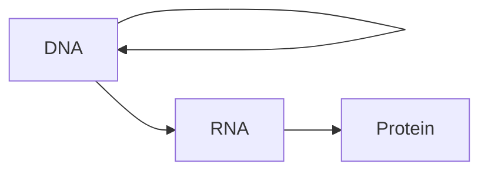

* Interesting - the thing composed of nucleotides ends up producing the thing made of amino acids
* Rules
  * Nucleotides hydrogen bond to one another
  * Hydrogen bonds (base pairing)
  * A = T
  * G ≡ C
  * Base pairing associated with complementary DNA strands
  * AATC => TTAG
    * Remeber 5' and 3'
    * 5'AATC3'
    * 3'TTAG5'
    * This is called an `anti-parallel` arrangement
    * (ds)DNA is `double stranded` DNA
    * Reminder - nucleotides added to 3' end
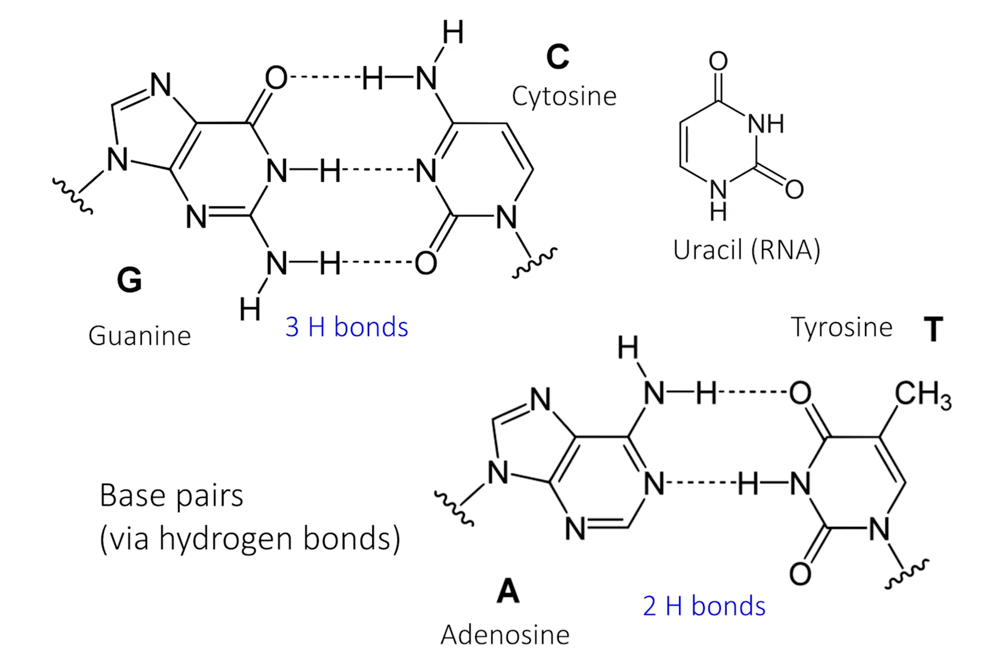
* Adenine is a purine = Thymine is a pyramidine
* Guanine is a purine ≡ Cytosine is a pyrimidine

### 3.2 Information Transfer in Biology - DNA Replication

* Replication produces DNA from a DNA template 
* Takes place in the nucleus
1. Separate the strands 
    * `5'-----3'`
    * `3'+++++5'`
2. Templates copied (copies are identical)
    * `5'-----3'         5'-----3'`
    * `3'+++++5'         3'+++++5'`
* Needs an `RNA primer` to start this process - she doesn't talk about how this works
* There exist leading and trailing strands during the copy

For the assignemnt 1, question 3, the RNA primer ends up producing DNA nucleotides, which was new to me.  Why did this happen?

Q: So where do the original DNA strands originally involved end up?  Are they rejoined or split?  Acc. [Wikipedia](https://en.wikipedia.org/wiki/DNA_replication), the chromosome "forks" and each strand ends up joined to a new strand that started from the RNA primer (or primers, depending on whether leading or trailing), which are then replaced with DNA segments and joined following the completion of the replication.

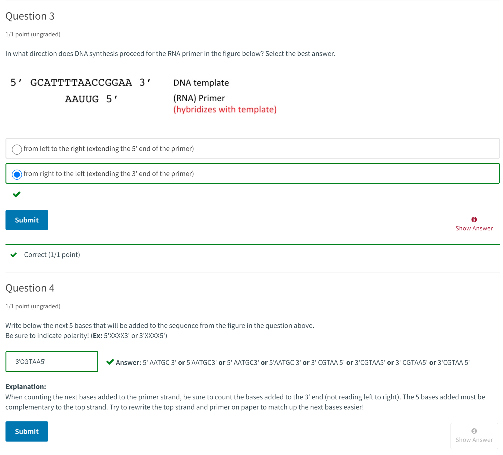

### 3.3 Transcription 

* First step in information transfer
* Produces RNA that is copied from DNA template
* RNA uses uracil instead of Thymine
* Only `one` DNA template strand is used
* `5'-----3'`
* `3'+++++5'`
* DNA strands separate - Only one is used as the template
* e.g., `5'xxxxx3'` -> 
    * RNA is copied (transcribed)
    * RNA leaves the template
    * Template and non-template come back together
* The extra hydroxyl group in ribose makes it more reactive.  Thus DNA is better for storage, whereas ribose is more transient
* There are particular DNA sequences that regulate where transcription begins and ends.  Ooh,  what are these? 

### 3.4 Translation

* Process that produces protein from an RNA template
* Creating amino acids from nucleic acids.  How do nucleic acids encode proteins?
* produces protein from mRNA template (cytoplasm), via genetic code
    * triplets of RNA bases.  
    * Each triplet encodes 1 amino acid
    * Each triplet is called a codon
* requires tRNA and ribosomes
* mRNA (messenger RNA)
    *  read 5' -> 3'
    * Amino acid add C to end, so protein is made in the N -> C direction
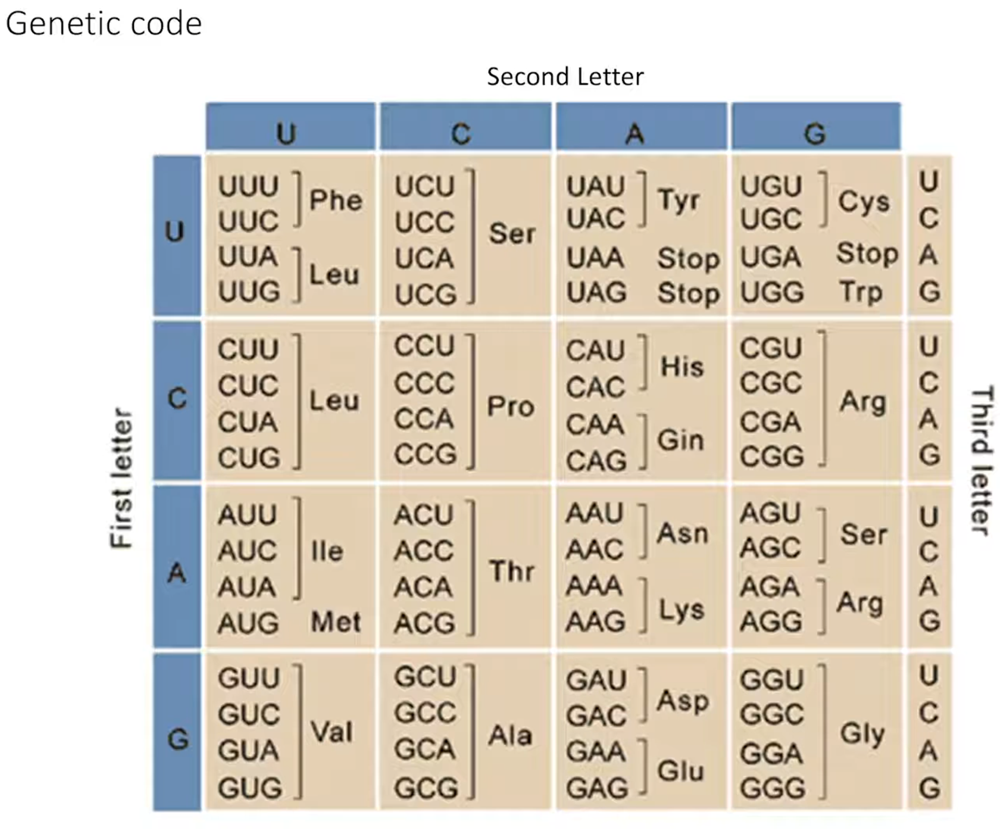
* All proteins start with methyamine
* Interpreter == tRNA, or translation RNA.  
    * Recognizes codons on the mRNA
    * A tRNA `anticodon` and mRNA `codon` base pair
    * e.g., mRNA 5'AUG3' (codon)   tRNA 3'UAC5' (anticodon)
* tRNAs also carry correct amino acids (covalently bonded to tRNA)
    * e.g., tRNA(Met) is covalently linked to methyamind (Met)
    * always 5'AUG3' coding for N-terminus Met, which is the starting codon for protein synthesis
* Example
    * mRNA -> 5'AUG/AAA/ACU3' <= 3 codons
        * Codon1 - Met  =>  
        * Codon2 - Lys
        * Codon3 - Thr
    * tRNAs release their amino acids which covalently join and form a protein
    * Stop codon do not code for any amino acid, so translation stops

The codon table illustrates mRNA and the protein it eventually codes to, excluding the tRNA part

So, given a strand of DNA, we should be able to break it apart with the start/stop codes, figure out which RNAs are made, which tRNAs are made, and which proteins are synthesized

## Interlude - Problem Set 1

* Hydrophobic interactions occur between two groups that are hydrophobic (nonpolar) in nature, meaning the groups are made of C-C and C-H bonds. Ionic interactions occur between two groups that are charged, where one group has a positive charge and the other has a negative charge. Hydrogen bonds occur between a group that has an electronegative atom (N, O, or F) and another group that has a hydrogen (H) bonded to an electronegative atom.

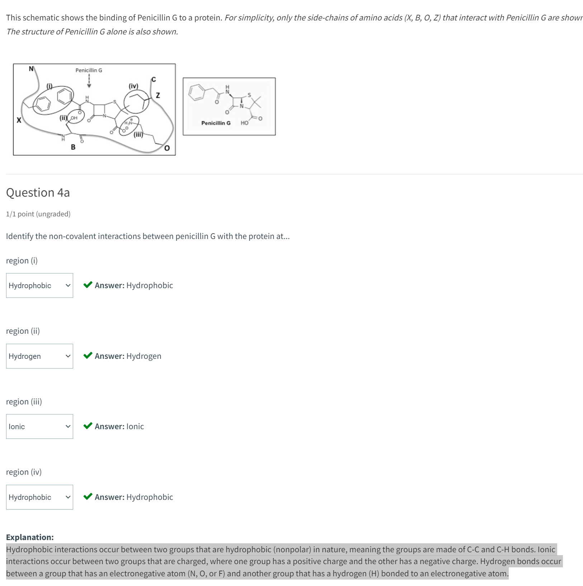

## Lecture 4: Inheritance and Genetics

* How does a DNA sequence relate to a trait (aka phenotype)?

### 4.1 Genes to Proteins

* DNA (gene) -> RNA -> protein -> 'trait'
    * trait == observable charateristic == `phenotype`
* DNA base changes = `mutations`
    * => Alter protein sequence/function
    * => may thus change a trait
* 2 Types of mutation
  * Point mutations - change 1 base at a time, substituting a different base at the same point
  * insertions/deletions
    * insertions - add one or more bases
    * deleations - remove one or more bases
* Results of mutations
    * missense - one amino acid in a protein is changed
    * nonsense (just truncates protein translation)
    * silent (same protein results)
* Question - are the different codons resulting in same amino acids exactly the same?
* Insertion/deletion "changes the reading frame"
* Can change protein coding, but can also change "control regions", which dictates whether the RNA is created in the first place
  * Alters RNA synthesis and thus protein


### 4.2 Allele Segregation

* `allele` - alternate form of a gene, aka variant
* wild type - the most common form a gene
* alleles may be "relative" to the wild type
* alleles are due to DNA sequence variations
* e.g., "apple gene" - apple^B (green) or apple^b (yellow)
* In 2n (diploid) cells, each chr pair has the same or different alleles of genes
* Mitosis yields child cells that result in the same alleles
* Meiosis yields child haploid (n) that are segregated, gamets do not have same allele set as parent
* Aside: Humans have 23 pairs of chromosomes
* Aside: B|b represents one pair of chromosomes, one from each donor
* Chromosomes can get "mixed up"  during meiosis.  This is crazy.

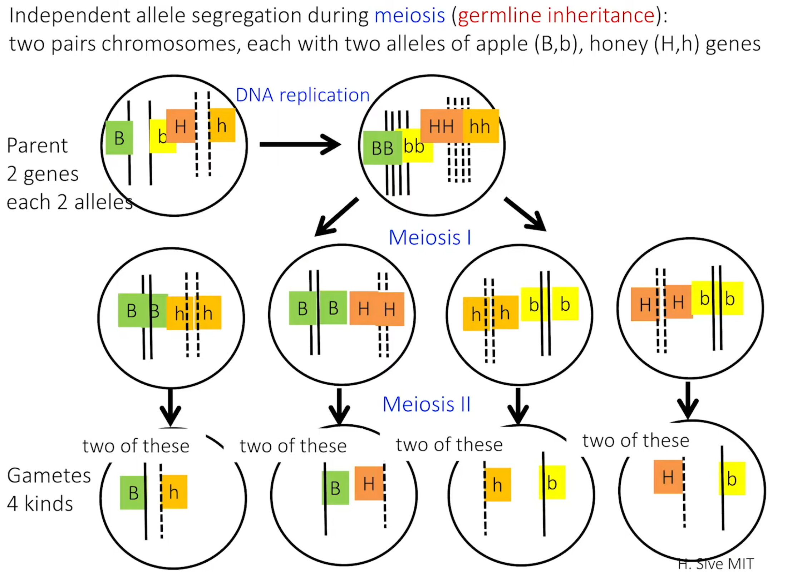

* The only one that can't be copied into meisos 1 is the homolog

 ### 4.3 Punnet Squares

* Reflection: am i more interested in biochem or molecular biology?  Or genomics?
* genotype => genes of an individual
* phenotype => observable trait
* gene => hereditary unit
* allele => alternate gene forms
* generation => individuals that are born at the same time from the same parents
* P = parents, F1 = first gen offspring, F2 = second gen offspring
* Traits can be
  * dominant
  * codominant => e.g., red + white azaleas
  * recessive => sickle cell
  * incompletely dominant 
* monohybrid cross (1 trait, 1 gene)
* homozygous -> BB, bb
* heterozygous -> Bb


|  P2\P1   |   B   |   B   |
|----------|-------|-------|
|    b     |   Bb  |  Bb   |
|    b     |   Bb  |  Bb   |


* phenotypes can be used to identify dominant/recessive genes
* A test cross - cross a parent 
* e.g., Determine whether parent is BB or Bb 
  * Cross to bb (true breeding) means you know what you have in your breeding stock
  * Statistics


### 4.4 Pedigrees

* Traits can be the results of many genes
* `Pedigree` - Genetics from a family history
* O = female, empty squard = male,  ■ = filled => trait is present
* Types of chromosomes
  * autosomes => paired
  * sex chrs => XX (female, paired), XY (male, unpaired, very different)
* pedigrees
  * autosomal recessive  - affect males, females equally
  * autosomal dominant - affect males, females equally
  * X-linked recessive - affect males more, transmitted to sons from mother
* X^R Y is how traits are written on the X-linked chromosomes.

## Lecture 5 - Building with DNA

### 5.1 Restriction digests

* Genetic Engineering
  * Recombinant DNA technology => DNA construction made in the lab
  * Molecular cloning => Making lots of the same DNA

Basic steps of building recombinant DNA (recombinant: from 2 or more sources)
* Gene of interest (GOI)
* `Cut` out GOI DNA from a larger piece 
* `Paste` GOI into a `vector` (DNA).  A vector is a carrier of DNA (which is itself DNA).  Has the characteristic that it replicates very quickly
  * What factor makes DNA replicate quickly vs slowly?

Cutting DNA:
* Done with reagents called `Restriction Endonucleases` (RE)
  * Very precise. These enzymes recognize particular DNA sequences
* Leave `blunt` and `sticky` ends
* `Blunt`
  * e.g., Blunt-ended RE => Sma1, a particular bacterium from which this was isolated; it identifies a viral invader and disables it by cutting out specific viral DNA sequences
  * `5'CCC GGG 3'`is the recognition site
  * `3'GGG CCC5'` antiparallel part
  * Cuts in the middle 5'CCC/GGG3' and 3'GGG/CCC5'
  * Yields:
    * `5'CCC3'`  `5'GGG3'`
    * `3'GGG5'`  `3'CCC5'`
  * Called `blunt` because "there is no nucleotide sticking out; the ends of hte two pieces are flush".  What does this mean?  
    * I believe it means that there's no free binding site; all nucleotide bases are accounted for
  * Note that Sma1 is a palindrome.  Many are.
* `Sticky`-ended
  * Ex. EcoR1 => 
    * `5'G AATTC3'`
    * `3'CTTAA G5'`
  * Yields:
```
    5'G      |____    AATTC3'
    3'CTTAA       |       G5'

    These are two separated segments.
```

  * Single-stranded DNA left on the ends, which is free to base pair with something else.
  * This is called a 5' overhang; more DNA toward the 5' end
* \> 3,000 known REs, named after their donor organisms (are they always bacteria?)

I didn't realize this, but the cut strans will still be joined

### 5.2 Compatible Ends

* Vector & ligation
* `Vector` => A virus that grows in bacteria
  * Made of DNA, often circular.  Circular viruses are called `plasmids`
  * Has `ORI` => Origin of replication == start site of replication/DNA synthesis (refers to DNA replication)
  * Allows vector to replicate => 10^4 copies/cell => lots of DNA
  * Also has a `selectable marker`
* GOI is pasted (covalently bonded via phosphdiester bonds) into vector using an enzyme called `DNA ligase`
  * Aside: if you hear a molecule with the 'ase' suffix, it's usually an enzyme
  * ligase joins two compatible DNA ends
  * Any two blunt ends of a of a restriction endonuclease (RE) can ligate
  * Two complementary sticky ends can ligate
  * may or may not reform a restriction endonuclease site
  * Note: this is complicated
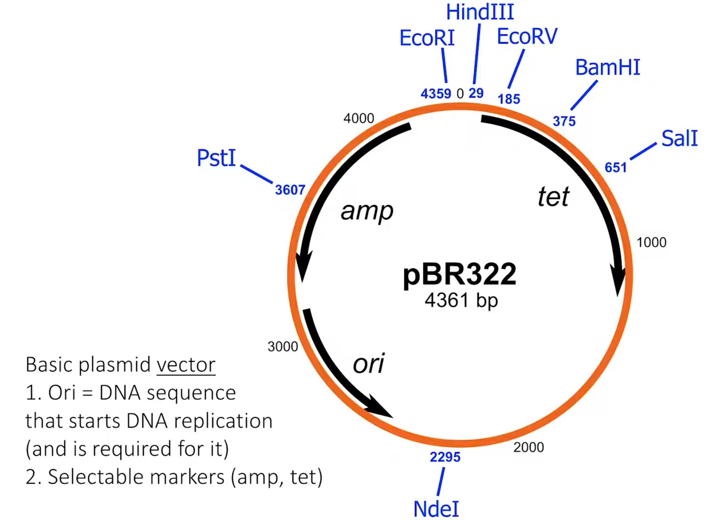
* Process:
  * Prepare your vector: cut with same RE as cut GOI
  * (SO vector + GOI piece have compatible ends
  * Add DNA ligase: joins vector-GOI molecules
  * Insert vector-GOI into host bacteria (`transform`)
  * `Select` for bacteria + plasmid.  Not all will have the gene of interest.  Typically by using an anti-biotic to kill the unomodified ones.  That's the reference to the selector sites in the image.
  * plasmid + GOI replicate in bacteria

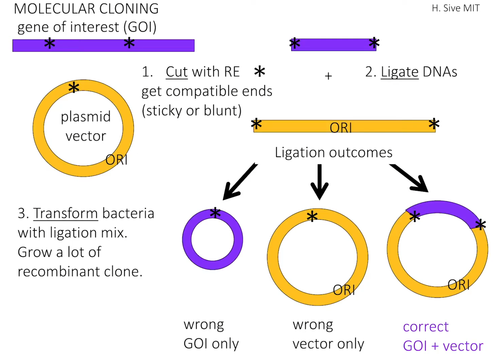
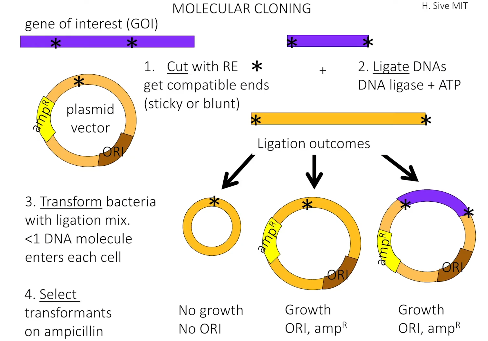
Note: In the above, ampR is ampicillin, a gene that indicates resistance to penicillin, so penicillin won't kill the bacteria with this marker, and so you can use them to obtain anything that isn't the GOI-only outcome

### 5.3 PCR: Polymerase Chain Reaction

* It's a replification technology
* `Denature` - break apart into single strands
* dsDNA
  * `5'-------3'`
  * `3'+++++++5'`
* 95 degrees Celsius denatures it
* Add (anneal) primers to both strands
  * Short pieces of complementary DNA
  * Gives 3'OH to allow DNA synthesis
```
   5'---------3' = template
        <- 3'+5' = primer
```

From this primer, DNA synthis happens

* Taq DNA polymerase, special kind protein/enzyme (?)
* Outcome:
```
5'-------3'
3'-------5'
```

* Oh, the `--` means a free hydroxyl
* This happens again and again because Taq polymerase can withstand the temperatures necessary for denaturing DNA
* Repeat cycle:
  1. Strand separation (95 C)
  2. Primer annealing (55 C) (introduction of a primer that does the initial binding for synthesis)
  3. DNA polymerization (~65 C)/synthesis

So this results in a repeated cut/polymerization process simply by raising and lowering the temperature

30 cycles : 1 DNA -> 10^9.  Process is exponential 2^n