# Disclaimer:

These are notes while I progressed through [51A - Organic Chemistry](https://open.uci.edu/collections/open_chemistry.html) provided by UC Irvine as part of its UCI OpenChem initiative.

The content for this course is covered by the [CC BY-SA 3.0 license](https://creativecommons.org/licenses/by-sa/3.0/us/legalcode), the gist of which can be found [here](https://creativecommons.org/licenses/by-sa/3.0/us/).  The notes below are my own, and any modifications to images are annotated below the images.

## Quick Help: Typing Key Codes

https://usefulshortcuts.com/alt-codes/maths-alt-codes.php

* ▲ = alt+30
* δ = alt+235
* ≡ = alt+240
* ■ = alt+254
* ∃ = ??????
* ↓ = alt+25
* ↑ = alt+24
* π = alt+227
* σ = alt+229
* ║ = alt+186
* µ = alt+230
* ⇌ = ??????

## Week 1, Lecture 1

An unstable nucleus is radioactive, like Carbon-14.  Half-life is effectively, "the percentage of Carbon-14 left in a thing after a given time."  It will lose half of its atoms after 5730 years.  There's an expected % of Carbon-14 (a measurable trace) in a ratio of all Carbon atoms in a sample.  This is carbon dating

* Fishhook arrow shows movement of 1 electron (1 e-)
* Interesting.  Molecules are held together by electrostatic interaction (attraction of opposite charges) in a crystal lattice, not due to the electron sharing
* Electronegativity trends
  * Farther right => greater electronegativity
  * Farter up => greater electronegativity
  * So, F is most electronegative. 
  * If EN > ~1.8 between two atoms (in general), the electron will be transferred and the bond will be ionic.  ∃ exceptions 

 
## Week 1, Lecture 2

* Exception to the EN > 1.8 ionic bond rule is HF
* Most of OChem is covalently bonded, joined by sharing electrons
* HONC-1234 --> H and Halogens make 1 bond, O makes 2, N makes 3, C makes 4.  This is for `neutral atoms`, not ions
* A charged atom is one that has a formal charge, which is an atom that doesn't exhibit the expected # of valence electrons

* Aside - What causes ions to happen??
* Funky - C+ only makes 3 bonds despite not then having a full valence shell??  Or can we read this "when Carbon is bound in this structure, this is the ionic configuration it will have?"
* Formula for formal charge = (# valence e-) - (1/2 # bonding e-) - (# nonbonding e-)
  * Example => H5C2NO =>
    * For O => 6 - 1/2(2) - 6 = -1
    * FOr N => 5 - 1/2(8) - 0 = +1
    * This is easier to see if you look at the structure
* Exceptions to the octet rule
  * Third row and higher elements have `d orbitals` available for bonding, so they sometimes exceed an octet in their valence shell.  H2SO4 and H3PO4 are examples.  In H2SO4, the S has 12 shared electrons.  In H3PO4, P has 10
  * Ugh, then how do you reason about these???
* Boron, like Carbon, can make 3 shared bonds and leave an open valence shell.  Example is BF3, B has only 6 valence electrons.  Open shell compounds can accept a pair of electrons to complete an octet, which it does in a chemical reaction.  Example is the Lewis acid called Boron tri-fluoride
  * NH3 + BF3 = H3BNF3 in a new covalent bond, and the N would be cationic (+1) and the Boron would be anionic (-1)
* Aside: I really need to be able to embed drawings
* Representations:
  * Molecular formula (C2H5O)+
  * Condensed Structure CH3CH(O+)H 
  * ^^^^ These are the same molecules
* Another example:
  * CH3C(CH3)2CH2Cl
```
              H
              |
    H     H - C - H     H
    |         |         |
H - C ------- C ------- C - Cl 
    |         |         |
    H     H - C - H     H
              |
              H
```
* Example (Tricky, just have to remember it)
  * CH3COCH3 <=> CH3C(=O)CH3
```
    H   O    H
    |   ||   |
H - C - C -- C - H
    |        |
    H        H
```
* Another hard example/exception: CH3CO2H or CH3COOH
  * Helpful CO2 in a condensed typically means C bonds with 2 O
```
    H   O
    |  ||
H - C - C - O - H 
    |
    H
```
* Lewis structures
  * Explicitly shows all bonding and non-bonding electrons, as well as formal charges on atoms
  * Example
``` 
    H   H
    |   |   ..
H - C - C = O  - H
            +
 
```

## Week 1, Lecture 3

* Common Angles: 109.5, 120
* Skeletal (Bond-Line) Structures are the normal biochem structures, typically when rings are present
  * Must include formal charges in these
  * Hydrogens are required when bonded to something other than Carbon
* Can combine representations
```
         O
         ||
\  / \  / \  
 \/   \/   \
            OCH3
```

* Total number of electrons should be even; if not, there's an unpaired electron, which is called a `radical`.  This shouldn't show up anywhere else in this class
* For Lewis structures, don't forget to draw non-bonding (lone pair) electrons
* Don't use lines for lone pairs in OChem (Note: I wouldn't have done this anyway)
* Ethylene = CH2CH2 (ugh, I really need a better way to draw these)
```
     H    H
     |    |
H -- C == C -- H
```
* [CH3CHOH]+ => 2C + 5H + 1O  == 2(4e-) + 5(1e-) + 6e- - 1e- = 18e-  <== It's even
  * Oh, interesting.  "Distribute electrons to the "more electronegative atom" first.
```
     H    H                          H    H
     |    |    ..                    |    |    +
H -- C -- C -- O -- H    <-->   H -- C -- C == O -- H
     |    +    ..                    |         ..
     H                               H
```
* When there are multiple ways to draw something, they are called `resonant structures`.  Either the above or the below is correct. The charge is on the "molecule", not necessarily an individual atom in the molecule
  * That said, figuring out where the charge is is as follows: Calculating formal charge of an atom in a Lewis structure is not about making the total number of valence electrons 8, but instead by counting the number of electrons the atom is supposed to "own" based on its neutral configuration.  In the above diagram, in the left resonance structure, the Carbon "owns" 3 electrons, so it's missing one.  In the right structure, the O "owns" 5 from its bonds (lone pair, 2 from the double bond, 1 from H), which means it's missing one.
* Curvy arrows show movement of electrons.  For instance, in the left, the pair on the O would arrow to the bond between the C and O
* Resonance structures differ only in the arrangement of electrons.  The middle arrow is called a `resonance arrow`.  Note that the two different structures are **NOT** in equilibrium.

> Note: The annotations on the above are the instructor's
* Hybrid structure
  * Aside: I need to re-learn what a pi bond () is
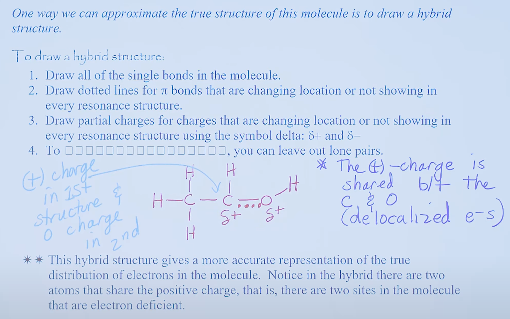
> Again, annotations are the instructor's
* Resonance structures are *not isomers*.  `Isomers` differ in arrangement of *both* atoms and electrons, whereas resonance structures differ only in arrangement of electrons.  `Constitutional isomers` have the same molecular formula but different connectivity.
* Two resonance structures are not equivalent in electricity
* Look for the following structural features ***in the order of importance***
  1. Resonance structures w/ more bonds and fewer charges are more stable
  2. Resonance structures in which every atom has an octet are more stable
  3. Resonance structures that place a *negative* charge on a more electronegative atom are more stable
* Thus, in the example above, the left side is the `minor resonance contributor`, while the right is the `major resonance contributor`.  The main reason is that the left representation has fewer covalent bonds (#1) and Carbon has no octet (#2).  However, notice that the right has a *positive* charge on Oxygen, which would be in the left's favor.  However, that rule is superceded by the first two.
* Don't draw resonance structure with a 2+ or 2- chage.  They almost never happen (except things like Ozone).
* Don't exceed an octet for second-row elements.

## Week 1, Lecture 4

* Side: What is VSEPR?  Valence Shell Electron Repulsion theory
* Molecular shapes:
  * Angular (aka bent) - Bond angle is ~105 (like H2O)
  * Tetrahedral - Bond angles are ~107 (like CH4)
  * Trigonal pyramid - Bond angles are ~109.5 (like NH3)

* Need to more fundamentally understand resonance structures.  Read the chapter
* Orbitals
  * Ψ - Wave function - indicates `phase`. When Ψ > 0, phase is positive.  When Ψ < 0, phase is negative.  This is not indicating charge
  * Heisenburg uncertainty principle - Exact position of an electron cannot be specified; only the probability that it occupise a certain region of space can be specified
  * When Ψ = 0, it's called a node.  There is 0 probability of finding an electron
  
  * This is why 3rd row elements can have > 8 electrons
  * 1s, 2s, 2p, 3s, 3p, 3d, 4s, 4p, 4d, 4f
* Aside: Look up Pauli exclusion principle and electron spin
* Degenerate - you put one electron in each orbital before pairing
  * 
  * Aufbau principle - lowest energy filled first
  * Degenerate orbitals are filled with one electron each before electrons are pairs (Hund's Rule)
* Molecular orbitals 
  * Covalent bonds combine atoms with atomic orbitals to form molecular orbitals
  * For H2 bond, the inter-nuclear distance is 0.74 Angstrom, which is the maximum attraction, minimum repulsion.  This is called the `bond length`
  * H2 has 104 kcals/mole of `bond dissociation energy` -> Energy needed to break the bond
* 2 waves in the same phase are said to `reinforce` (additive) and two waves in different phases `interfere`.
* Aside: this lecture was information-dense

## Week 2, Lecture 1 (Lecture 5)

* Bring to Hydrogens together in the same phase causes a bonding molecular orbital, sigma bond which has circular symmetry about the axis connecting the nuclei
  * Recall: 0.74 Angstroms
* If you bring them together in opposite phases, you create an `anti-bonding molecular orbital`.  It's **not** a bond. 0 probability of finding an electron between the H atoms

 * Note: Dark red annotations are mine, not the professor's

* pi bond has electron denisty both above and below the line that connects the two nuclei, and it has a nodal plan
```
    |        ----   sigma*
    |
    |        ---- pi*
    |
    |---------------------------    <--- energy of isolated atomic orbitals
    |
    |        ---- pi
    |
    |        ---- sigma
```


* Problem 1: we only have 2 unpaired valence electrons in Carbon
```
2p     ↑   ↑    _
2s         ↑↓

1s         ↑↓
```

* Solution 1: We promote an electron in carbon to form the unpaired outer shell for bonding

```
2p    ↑    ↑    ↑           
2s         ↑            

1s         ↑↓
```
* promotion from 2s to 2p costs (consumes) 96 kcal/mol.  Bond with 4 H releases 420 kcal/mol (105 kcal/mol for each CH bond), so net energy is 324 kcal/mol.  If we didn't promote an electron, we would only release 210 kcal/mole.  So, energetically, it's better to promote an electron


* Using Methane (CH4) as an example:
   * Problem 1: 4 bonds in methane are identical.  Using 3p orbitals and one s orbital would not make 4 identical bonds (due to different bond lenths)
   * Problems 2: p orbitals are 90 degree angles to each other, but the bond angles in CH4 are 109.5 degrees.
   * Solution: We hybridize the orbitals (this is complex math)
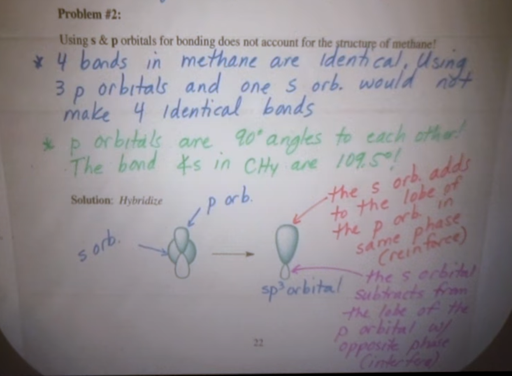


```
2p   ↑  ↑   _            
2s      ↑↓

  BECOMES

sp3  ↑   ↑   ↑   ↑
```
  * This forms tetrahedral
* Ethane is CH3CH3: Single Bond (alkanes are C-C sinlge bonds)
  * C-H bond is σ bond, overlap of 1sp3 and 1s
  * another way to state, is Csp3 & Hs
  * Note for me: sp3 will only happen on electron promotion
  * The C-C bond is a bonding molecular orbital, σ bond, 2sp3 & 2sp3
* Ethylene is CH2CH2: Double bond (C=C double bonds are alkenes)
  * It is a pair of trigonal planar molecules
  * This yields three sp2 and one 2p
```
2p  ↑  ↑   __

2s     ↑↓

  BECOMES (bybridized)

2p              ↑
sp   ↑  ↑  ↑
2s
```

  * Note the 2p orbital is perpendicular to the plane
  * This is example of double bond
  * all of them are σ bonds
  * Note that the p orbitals will also overlap to make 1 π bond (2p orbitals overlap)
  * Bond angles are not *exactly* what was predicted by VSEPR, but very close.  Reason is that π bond takes up more space than σ bond.
  * The C-C σ bond is shorter and stronger in ethylene than a standard C-C bond
  * Compared to C-H in ethane, the C-H bond length of ethylene is also shorter and stronger


## Week 2, Lecture 2 (Lecture 6)
* Reflection Note: Hybridization is about combining orbitals.  How do we determine the orbitals that need to be combined?  We determine based on the number of bonds and the number of orbitals.  Using Carbon...
  * The terminologies involed are the # of p orbitals that combine with s orbitals.  So, sp3 means that 3 p orbitals combine with 1 s orbita.  sp2 means that 2 p orbitals combine with 1s, and 1 p does not combine.  sp1 means 1s and 1 p orbital combine, leaving 2 alone.  What determines the number of p orbitals that combine?  (Note: Not electrons, orbitals!)
  * Basically, this is what's going on "under the hood" for single, double, and triple bonds
    * single bond: s orbital combined with all 3 p orbitals => sp3
    * double bond: s orbital combined with 2 of the p orbitals => sp2 (leaves 1p alone for a π bond)
    * triple bond: s orbital combined with 1 p orbital = sp (leaves 2p alone for 2 π bonds)
    * It's about the bond, not about the valence electrons!
  * If you look at the picture, the double bond means that we have a σ bond and a π bond between the Carbons (hence the "double")
  * If C is forming 4 bonds (e.g.., CH3CH3), then both 2s orbitals need to merge with both 2p orbitals to make 4 sp4 orbital
  * If C is forming 3 bonds (e.g., CH2CH2), then 
* Acetylene: Triple bond (C≡C triple bonds are alkines)
```
2p    ↑   ↑   __

2s        ↑↓

  BECOMES (hybridized)

2p          ↑   ↑
sp   ↑  ↑
2s
```
  * so the C≡C bond has a single σ bond and 2 π bonds
* Bond lengths & angles

| Bond   | C-C Length | C-H Length | Angle |
|--------|------------|------------|-------|
| Single | 1.54A      | 1.10       | 109.5 |
| Double | 1.33A      | 1.08       | 120   |
| Triple | 1.20A      | 1.06       | 180   |

* So, as # of bonds increases, bond length decreases FOR ALL BONDS and bond angles increases
* Bonding in Methyl Cation [CH3]+ and Methyl Anion [CH3]-
  * Cation: [CH3]+  => 3 bonds, means sp2 bonds
    * The p orbital in methyl cation is an empty p orbital
  * Anion: we have sp3 orbitals here
    * each bond is a σ bond b/w Hydrogen's 1s and  Carbon's 2sp3
    * Lone pair is in sp3 orbital
* sp3 hybridization whenever we have 4 groups
* sp2 whenever we have 3 groups
* sp whenever we have 2 groups
* Ultimately, we need a grand total of 4 orbitals
* Bonding in Hydrogen Halides
  * H-F is 1s and 2sp3 bond
  * HCl is 1s and 3sp3 bond.  The bond is longer, electron density is spread over a wider area,s o the electron density is lower than in HF.  
  * More overlap means stronger bond (more overlap among orbitals), less overlap means weaker bond
* On periodic table, size changes gradually (smaller) as you move to the right.  As you progress down a column, size changes dramatically (larger).
* A double bond is not twice as strong as a single bond, so a π bond must be weaker than a σ bond because sideways overlap is not as good

## Week 2, Lecture 3 (Lecture 7)

* Nonpolar Covalent bond - e.g., H:H or H-H, same electronegativities
* Polar Colavalent - e.g., H-CL    H is 2.2, Cl is 3.2
```
Representations:

δ+    δ-
H  -  Cl

H  :  Cl

H - Cl
+--->
```
* Ionic - Remember that the EN difference must be >= ~1.8 (exception is HF, which is ~1.8 but not ionic)
* Examples:
  * NaCl  =>  0.9,3.2
  * CH    =>  2.5, 2.2 <= This is actually considered non-polar because of how close the EN is
  * H-O   =>  
  * H-F   => 
  * H-Cl  => 
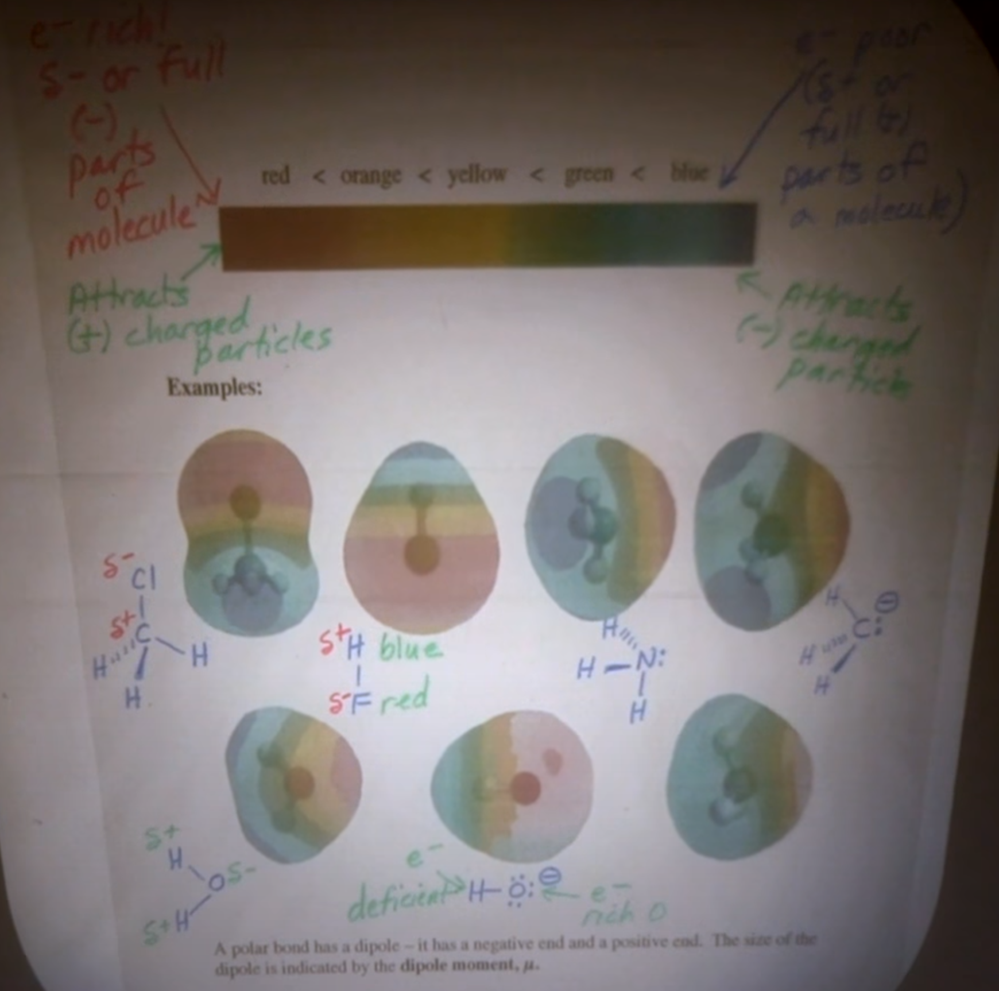
* Hydronium ion is hard - The H atoms are actually electron deficient even though the Oxygen is labeled with a positive charge.  This looks like NH3 (amonium).  The distinction is that the bonds are polarized with Oxygen being more electronegative.  The positive charge on Oxgyen has only to do with the difference between protons and electrons, not the overall bond polarity.
* A polar bond has a dipole (negative end and positive end).  The size of the dipole is indicated by the dipole moment
  * µ = e x d where e is the magnitude of the charge and d is the distance b/w the charges
  * Units are D (Debye)

|Bond | µ     | Bond  | µ     |
|-----|-------|-------|-------|
|C-N  | 0.22D | H-C   | 0.3D  |
|C-O  | 0.86D | H-N   | 1.31D |
|C-F  | 1.51D | H-O   | 1.53D | 
|C-Cl | 1.56D | C=O   | 2.4D  |
|C-Br | 1.48D | C≡N   | 3.6D  |
|C-I  | 1.29D | ||

* The possibly surprising one would be how close C-Cl and C-F are (C-Cl is actually larger), since F is much more electronegative.  F is 4.0, Cl is 3.5, C is 2.5.  The  C-Cl bond is much longer than C-F, though, which is what makes these similar
* Notes: 
  * The C-N vs C≡N difference is crazy.  The reason here, even though the triple bond is much shorter, is due to the  magnitude and the resonance structures.  The resonance structure are effectively additive.
  * C-O is smaller than C=O even though the C=O is shorter
  * Why?  It is the magnitude of the charge difference times the distance
* Polarity of Molecules
  * µ is the `vector sum` of all bond dipoles in the molecule
  * So the geometry matters
* ==Starting chapter 2: Acids and Bases==
* Bronsted acid: a species that donates a proton
* Bronsted base: a species that accepts a proton
* Bronsted-Lowry acid - must contain a hydrogen
* Bronsted-Lowry base - must be able to form a bond to a proton
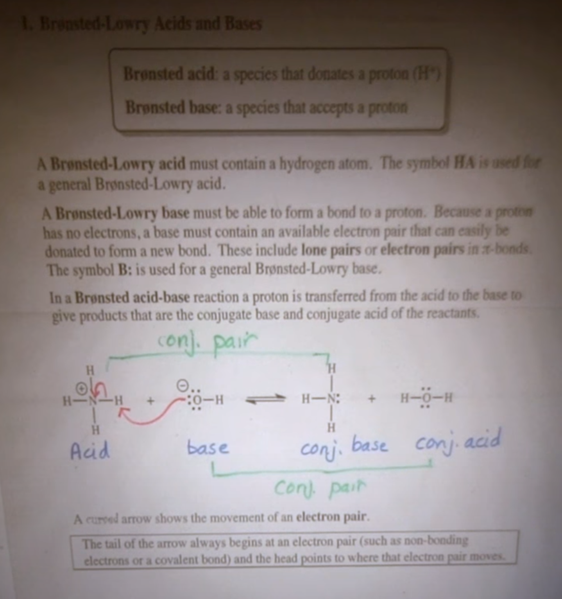
* Curved arrows show the movement of electrons, not atoms
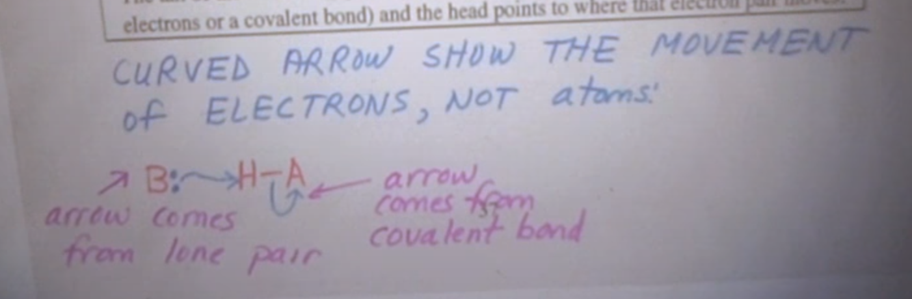

## Week 3, Lecture 1 (Lecture 8)

⇌
(Aside: I don't know why, but I find this topic not as interesting)

* At equilibrium, the weaker acid and weaker base are the major species found in the reaction mixture
* amphoteric compounds can act as both acids and bases.  Water is the most popular example.  Acetic acid is another. CH3COOH.  Ammonia is also amphoteric
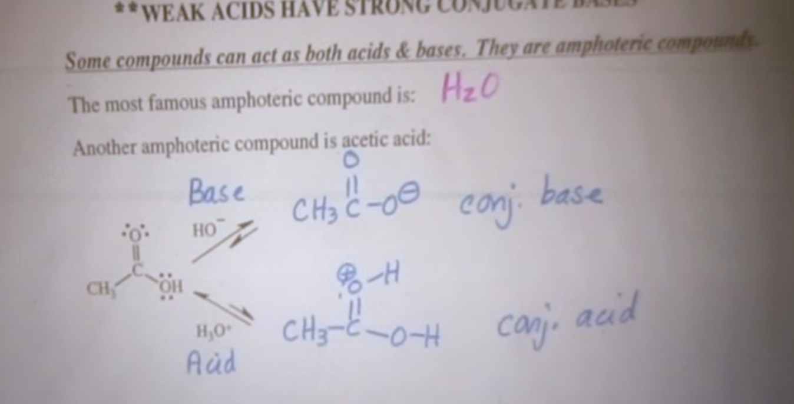
* Acid + Base ⇌ Conj. base + Conj. acid
* Strong acids have weak conj. bases and vv.
* The stronger pair will be on the left side of the equation
* Equilibrium constant (K_eq) = (concentration of reactants) / (concentration of products)
  * ([H2O+][A-]) / ([HA][H2O])
  * pKa is for dilute solutions = K_eq[H2O] = [H3O+][A-] / [HA]
  * pKa = -log_10 Ka
* larger pKa = weaker acid
  * pKa < 1 => very strong acid
  * pKa ~= 1-5 => moderate acid
  * pKa ~= 5-15 => weak acids
  * pKa > 15 => extremely weak acids
* Need to know these! below
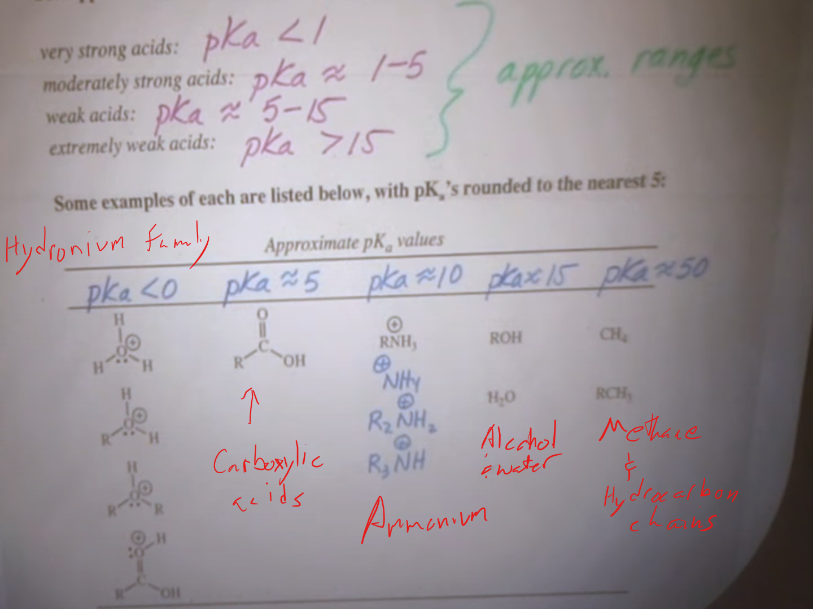
* Note: bright red markings are mine, not the instructor's
* How do we determine strength of bases?
  * In OChem, we don't use pKb (unlike gchem).  
  * The extremely weak acids are the extremely strong bases
* General way to do this.  Protenate the base to find the conjugate acid, look on the pKa chart
* Equilibrium favors the weakest acid side (and thus weakest base side)
* Determining ratio of reactants to products
  * 1:10^x if products are favored
  * 10^x:1 if reactants are favored
  * Example: CH3COOH (pka = 4.8) + NH3 ⇌ CH3COO- + NH4+ (pka = 9.2)
    * pka difference ~= 4 since rxn favored to the right
    * 1:10^4 reactants:products or 1:10,000
    * so, reaction has essentially gone to completion (equilibriums actually always go back and forth)
  * Equation is K_eq = 10^-(pKa reactant acid - pka product acid)
* Example question: which of the following bases is strong enough to deprotenate acetic acid (CH3CO2H)
  * HC3CO2H: pka = 4.8
  * conj. acid of H-: H2 pka 35
  * conj. acid of CL-: HCl pka -7
  * conj. acid of pyridine (C5H5...): pka = 5.2
    * so, the best one will be H- because the pka of the conjugate acid is higher
    * HCl would never work because of lower pka
    * pyridine is higher, but not enough; too close in pka
* Relationship b/w structure and acidity
  * Four factors affect acidity of H-A
    1. The Element Effect (`most important`)
    2. Inductive effects
    3. Resonance effects
    4. Hybridization effects
  * The Element Effect
    * acidity increases as you move to the right across any period
    * H3C-H: pka=48
    * H2N-H: pka=38
    * HO-H: pka=15.7
    * F-H: pka=3.2
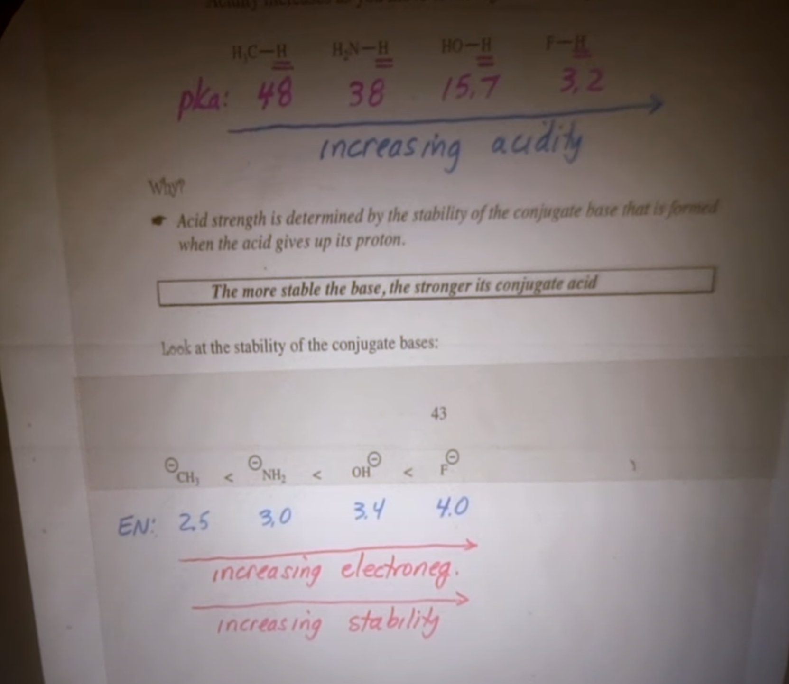
    * Acidity increases as we `descend` a vertical column in the periodic table
    * B/c when you go down a column, the size increases dramatically.  Size becomes more important than EN
    * Aside: I'm betting this is because larger atoms have a weaker hold on a Hydrogen (proton), and thus are more "willing" to donate it.
    * Less electron density in larger atom means it's more stable.  More stable = less basic
  * Inductive Effect
    * Presence of electronegative atoms.
      * Compare CH3CH2O-H (pka=16) and CF3CH2O-H (pka=12.4)
      * The 3 Fluorines are so strongly EN that they pull electron density away from Oxygen, making it less negative => more stable => less basic => more acidic conjugate acid
    
## Week 3, Lecture 2 (Lecture 9)

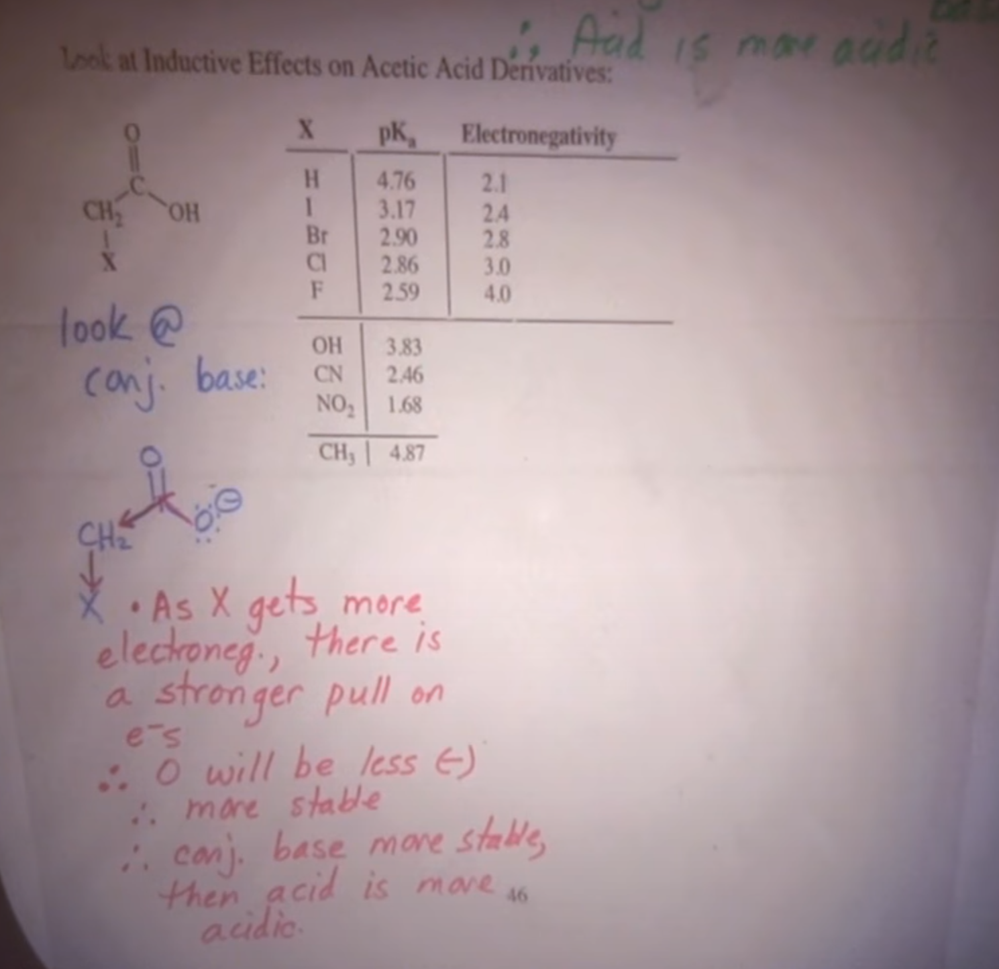
* Increasing electronegativity will increase the inductive effect, thus increasing acidity (the "desire" for it to donate a proton/Hydrogen)
* OH (Hydroxyl group), CN (cyano group), and NO2 (nitro group) are `electron-withdrawing groups` (EWG), but they can't be assigned EN because that is a uniquely atomic property.  Nitro group has the strongest effect; in fact, more powerful than Fluorine.
* Aside: CH3 is a methyl group.  The methyl group makes it less acidic.  The reason is that the methyl group is slightly electron donating.  Thus the conjugate base is less stable and thus less acidic
* Reviewed:
  1. Elemental Effect
  2. Inductive effect
    * Inductive effect is the pull of electron density through σ bonds caused by electronegative atoms.  Electronegative atoms stablize regions of high electron denisty by an electron-withdrawing inductive effect.
    * Inductive effect decreases as the EWG gets further away.
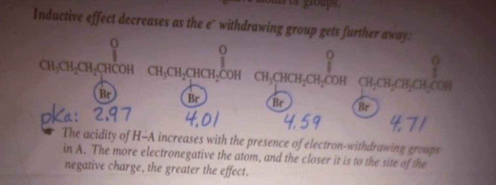
* New: 
  3. Resonance
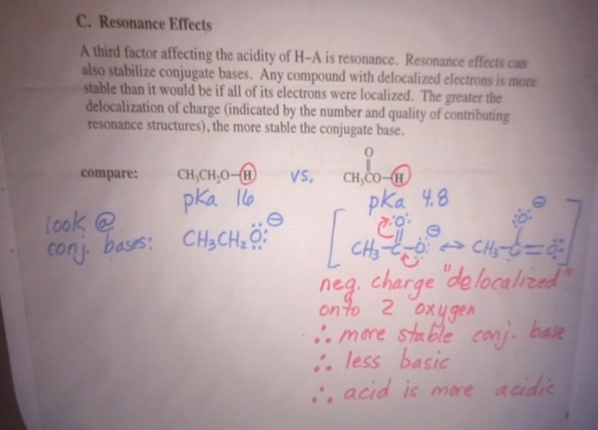
  4. Hybridization Effects
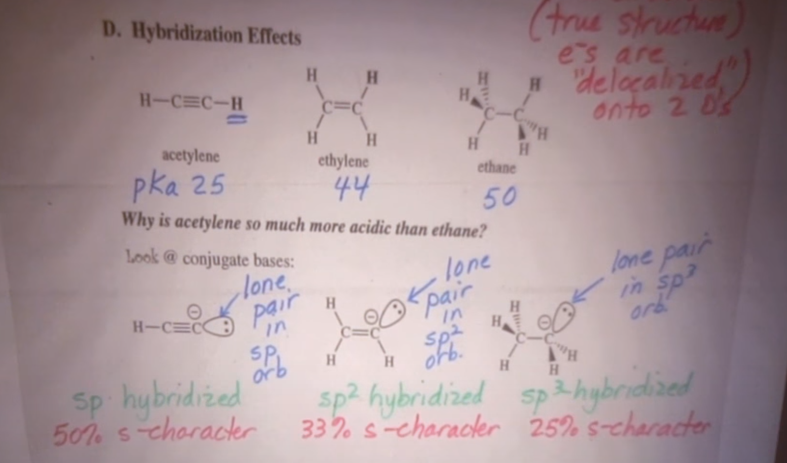
    * The reason is the "shape" and proximity of the sp, sp2, and sp3 hybridized shells
    * More s-character in hybridized bonds => electrons closer to nucleus => more stable conj. base => less basic => conj. acid is more acidic
* Strategy.
  1. Look for Element effect (look for acidic hydrogens and the atom it's bonded to).  Identify the atoms bound to the acidicy hydrogen.  If the H's are bound to different atoms, use periodic trends to assign relative acidity.
  2. IF the 2 H's are bound to the same atom, draw the conjugate bases and look for other points of difference
  3. Then look for these 3 things:
    * Do electron withdrawing groups stablize the conjugate base?
    * Is the conjugate base resonance stabilized? 
    * Look at the hybridization of hte conjugate base.  Does increased "s" character stablize the conjugate base?
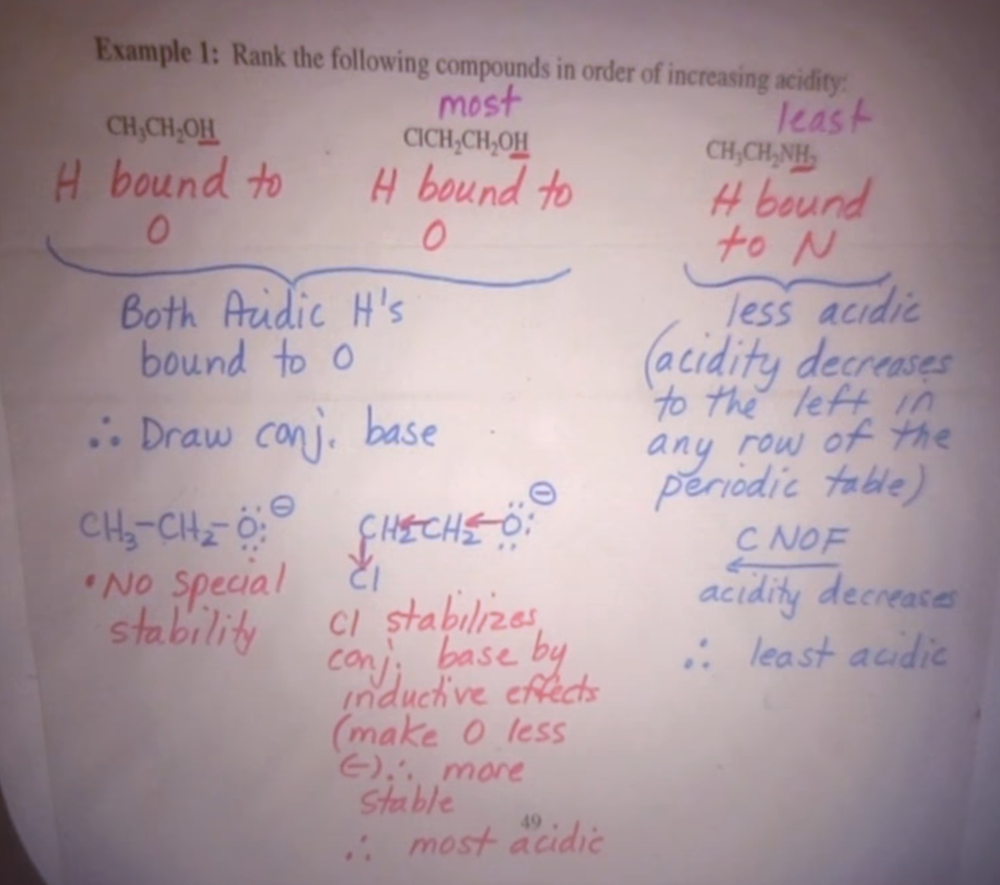
* Aside: Resonance almost always has more effect than hybridization, but she doesn't test this concept this early
